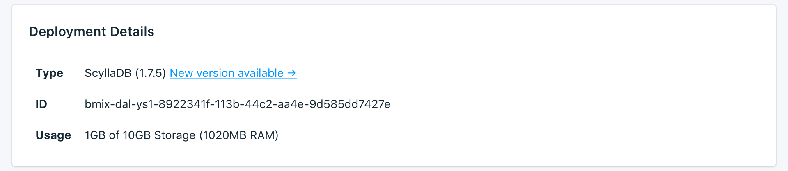

---

Copyright:
  Years: 2017
lastupdated: "2017-11-15"
---

{:new_window: target="_blank"}
{:shortdesc: .shortdesc}
{:screen: .screen}
{:codeblock: .codeblock}
{:pre: .pre}

# Service Overview

The _Overview_ page shows you information about your {{site.data.keyword.cloud}} Compose database. The overview includes essential identifying information and current resource usage. You'll also find a section for connection strings that you can use with tools or make use of tools to connect to your database.

## Deployment Details

The _Deployment Details_ panel shows details of your service.

### Type

The type of database that is offered by the service, and the database version that your service uses.

### Name

An internal identifier for the service.

### Usage

The size of your database and the amount of storage provided by your service plan.

## Connection Strings

You'll find each Connection String for your service in a different tab in the _Connection Strings_ panel.

### HTTPS

A URI-formatted connection string that can be used by some client libraries and contains all the information needed for other libraries to connect. You can find out how to use the Connection String to connect in [Connecting an external application](./connecting-external.html).

### Command Line

The **Command Line** is a preformatted command which will invoke `cqlsh` with the correct parameters. The displayed command include required flags (`--ssl` and `--cqlversion`).  To use it, you'll need to have the PostgreSQL client tools installed on the local system. You can find out more about how to do this in [Connecting an external application](./connecting-external.html).

### Maps
These address translation maps can be used in applications that require high-availability and can use auto-discovery to find nodes in the cluster. They translate the external portal addresses to the internal cluster addresses for client drivers that use this feature.

### SSL Certificate

Your Compose {{site.data.keyword.cloud_notm}} service provides you with an SSL certificate that you can use to connect to your database.

## Instance Administration API

You can manage your {{site.data.keyword.composeForScyllaDB}} service through the {{site.data.keyword.cloud_notm}} Compose API.

### Foundation Endpoint

The foundation endpoint is composed of the region the service resides in and the service instance id. It will be at the start of every endpoint.

### Deployment ID

The deployment ID is necessary for most calls, and identifies the specific deployment instance.

### Reference

For more documentation and reference for using the {{site.data.keyword.cloud_notm}} Compose API, across all {{site.data.keyword.cloud_notm}} Compose services, read [The {{site.data.keyword.cloud_notm}} Compose API](https://www.compose.com/articles/the-ibm-cloud-compose-api/).
