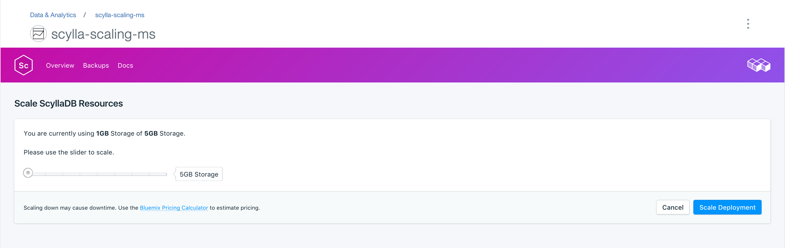
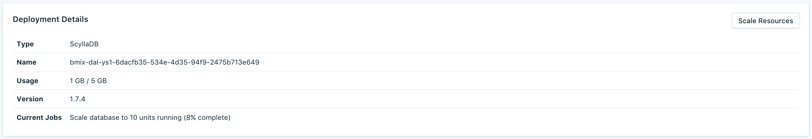

---

Copyright:
  Years: 2017
lastupdated: "2017-09-07"
---

{:new_window: target="_blank"}
{:shortdesc: .shortdesc}
{:screen: .screen}
{:codeblock: .codeblock}
{:pre: .pre}

# Scaling Resources

If your service needs additional storage, or you want to reduce the amount of storage allocated to your service, you can do this by scaling resources.

1. Navigate to your service's _Overview_ page.
2. In the _Deployment Details_ panel, click **Scale Resources**. The Scale Resouces page opens.

    

3. Adjust the slider to raise or lower the storage allocated to the {{site.data.keyword.composeForScyllaDB}} service. Move the slider to the left to reduce the amount of storage, or move it to the right to increase the storage.
4. Click **Scale Deployment** to trigger the rescaling and return to the dashboard overview. A 'Scaling initiated' message appears at the top of the page to let you know the rescaling is in progress.

    

    When the scaling is complete the _Deployment Details_ pane updates to show the current usage and the new value for the available storage.