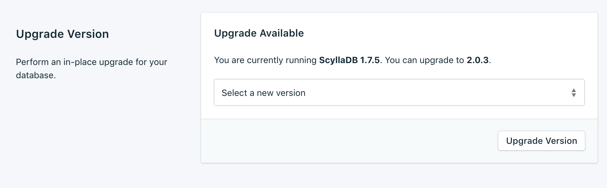
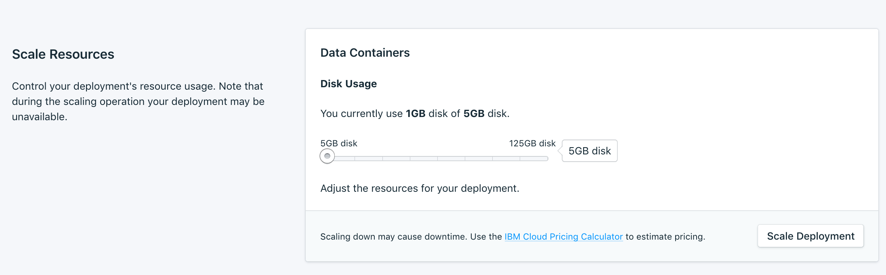
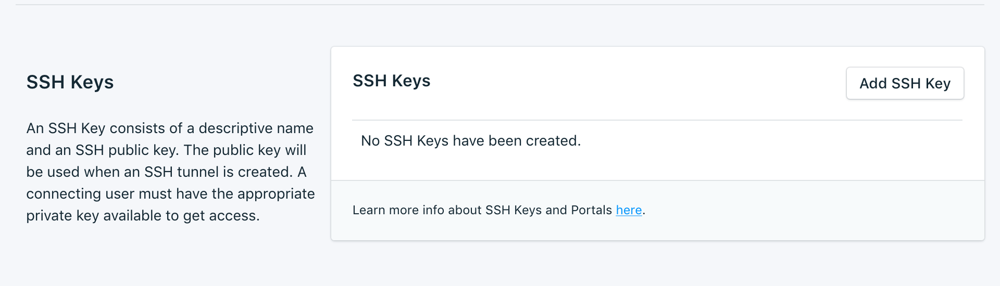

---

Copyright:
  years: 2017,2018
lastupdated: "2017-12-11"
---

# Settings
{: #dashboard-settings}

Use the {{site.data.keyword.composeForScyllaDB_full}} to adapt your service to better suit your needs and requirements.

## Upgrade Version

If a new version of the database is available, you can select which version you would like to upgrade to from a drop-down menu. Otherwise, your service is on the newest version available, and the panel displays the current version information.

## Scaling Resources

You can increase or reduce the amount of storage that is allocated to your service by scaling resources.

1. Go to your service's _Overview_ page.
2. In the _Deployment Details_ panel, click **Scale Resources**. The Scale Resources page opens.

    

3. Adjust the slider to increase or reduce the storage that is allocated to the {{site.data.keyword.composeForScyllaDB}} service. Move the slider to the left to reduce the amount of storage, or move it to the right to increase the storage.
4. Click **Scale Deployment** to trigger the rescaling and return to the dashboard overview. 

When the scaling is complete, the _Deployment Details_ pane updates to show the current usage and the new value for the available storage.

## Using Whitelists

To restrict access to your databases, you can whitelist specific IP addresses or ranges of IP addresses on your service. When there are no IP addresses in the whitelist, the whitelist is disabled and the deployment accepts connections from any system on the internet.

### IP addresses

The *IP* field can take a single complete IPv4 address or IPv6 address with or without a netmask. Without a netmask, incoming connections must come from exactly that IP address. 

Although the *IP* entry allows for IPv6, no Compose deployments are currently available to IPv6 networking and so these addresses cannot be filtered on.
{: tip}

### Netmasks
To allow a connection from a specified range of IP addresses, use a netmask. The IP address must be fully specified when you use a netmask. That means entering, for example, 192.168.1.0/24 rather than 192.168.1/24.

### Description
The *Description* can be any text that identifies the whitelist entry - a customer name, project identifier, or employee number, for example. The description field is required.

### Compose Services
Whitelist entries are automatically added to Compose's servers to allow them to connect.

### Removal

To remove an IP address or netmask from the Whitelist, click *Remove*.

When all the entries on the whitelist are removed, the whitelist is disabled and all IP addresses are accepted by the TCP access portals.

## SSH Keys
Scylla services are provisioned with an SSH portal to enable nodetool administration of the service. Add the public key and a name to get access to the SSH portal.

Information on how nodetool works with your scylla service is in [Using Nodetool](/docs/services/ComposeForScyllaDB?topic=compose-for-scylladb-scylla-nodetool).
