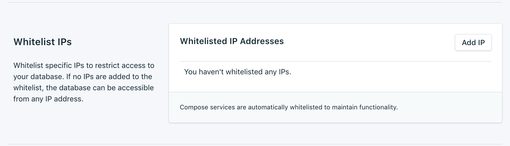

---

Copyright:
  Years: 2017
lastupdated: "2017-10-16"
---

{:new_window: target="_blank"}
{:shortdesc: .shortdesc}
{:screen: .screen}
{:codeblock: .codeblock}
{:pre: .pre}

# Whitelists

If you want to restrict access to your databases, you can whitelist specific ip addresses or ranges of ip addresses on your service. When there are no IP addresses in the whitelist, the whitelist is disabled and the deployment will accept connections from any system on the internet.

## IP Addresses
The *IP* field can take a single complete IPv4 address or IPv6 address with or without a netmask. Without a netmask, incoming connections must come from exactly that IP address. 

Note that although the IP entry allows for IPv6, no Compose deployments are currently available to IPv6 networking and so these addresses cannot be filtered on.

## Netmasks
To allow a connection from a specified range of IP addresses, use a netmask. The IP address must be fully specified when using a netmask. That means entering, for example, 192.168.1.0/24 rather than 192.168.1/24.

## Description
The *Description* can be any user-significant text for identifying the whitelist entry - a customer name, project identifier or employee number, for example. The description field is required.

## Compose Services
Whitelist entries are automatically added to Compose's servers to allow them to connect.

## Removal
To remove an IP address or netmask from the Whitelist, click the *Remove* entry displayed next to it.
When all entries on the whitelist are removed, the whitelist will be disabled and all IP addresses will be accepted by the TCP access portals.
