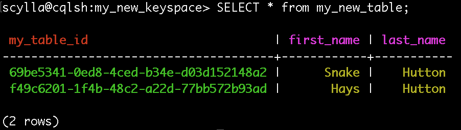
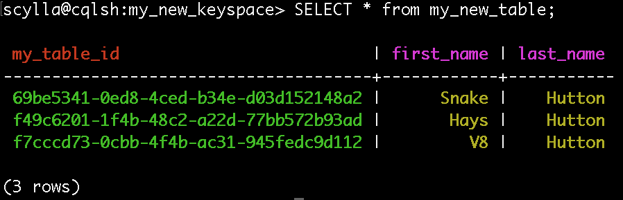

---

copyright:
  years: 2017,2018
lastupdated: "2017-06-16"
---

{:new_window: target="_blank"}
{:shortdesc: .shortdesc}
{:screen: .screen}
{:codeblock: .codeblock}
{:pre: .pre}

# Externe Anwendung verbinden
{: #connecting-external-app}

Sie finden die Informationen, die Sie zum Herstellen einer Verbindung zu {{site.data.keyword.composeForScyllaDB_full}} benötigen, auf der Seite *Übersicht* Ihres {{site.data.keyword.composeForPostgreSQL_full}}-Service.

Sie können mit `cqlsh` eine Direktverbindung zu {{site.data.keyword.composeForScyllaDB}} herstellen. Wie Sie dieses Tool auf Ihre lokale Einheit abrufen, hängt von Ihrer lokalen Plattform ab. Am einfachsten ist es, das neueste Cassandra-Release mit einer für Ihre Plattform geeigneten Methode zu installieren (die neuesten Versionen unterstützen weiterhin Version 2.1.8, also Scylla) und den integrierten Befehl `cqlsh` zu verwenden.

Gehen Sie auf einem Mac beispielsweise wie folgt vor:

1. Installieren Sie Cassandra mit `homebrew`, indem Sie `brew install cassandra` eingeben.
2. Kopieren Sie einen der Befehle von der Übersichtsseite:

  

3. Fügen Sie den Befehl in Ihre Shell ein, um ihn auszuführen:

  

4. Wenn Sie `HELP` eingeben, sehen Sie, dass die Shell eine umfangreiche Funktionalität aufweist. Noch praktischer ist es, dass alle diese Befehle auch eine Fertigstellung namens `TAB` besitzen.
5. Geben Sie `CREATE KEYSPACE my_new_keyspace <TAB><TAB><TAB>` ein. Nun sollten Sie die Auswahlmöglichkeiten für die Replikationsklasse sehen.
6. Sie können hier `SimpleStrategy` auswählen, weil sich der Cluster nicht über mehrere Rechenzentren erstreckt.
7. Drücken Sie noch einmal `<TAB><TAB>` und geben Sie '3' für 'replication_factor' ein. Schließen Sie dann die geschweifte Klammer mit `}` und schließen Sie die Anweisung mit `;<enter>` ab.

  Sie haben gerade Ihren ersten Schlüsselbereich (KEYSPACE) erstellt und so eingestellt, dass Ihre Daten standardmäßig auf alle drei Knoten in Ihrem Cluster repliziert werden.

8. Nun können Sie den Schlüsselbereich verwenden:

  ```sql
  USE my_new_keyspace;
  ```

  Nun zeigt Ihre Shell an, dass Ihre Eingabeaufforderung Ihren Schlüsselbereich standardmäßig verwendet:

  

  Jede Tabelle muss einen Schlüsselbereich haben. Wenn Sie hier einen Schlüsselbereich in der Shell erstellen, hat er standardmäßig den Namen `my_new_keyspace`.

  Zwar hat sich Scylla/Cassandra so weiterentwickelt, dass es eine Schemasprache besitzt, die SQL sehr ähnlich sieht, doch ist das in Wirklichkeit nicht so. Im Gegensatz zu RDBMS ähnelt eine Zeile hier viel eher eine Schlüsselwertsuche. Es ergibt sich einfach, dass der Wert ein flexibles Schema hat, das Sie gerade definieren wollen:

9. Geben Sie in der Shell den folgenden Befehl `CREATE TABLE` ein, um einen Bereich zu erstellen, der mit Beispielen gefüllt werden kann.

  ```sql
  CREATE TABLE my_new_table (
    my_table_id uuid,
    last_name text,
    first_name text,
    PRIMARY KEY(my_table_id)
  );
  ```

## Verbindung über die JVM herstellen

Einer der innovativsten Treiber für Cassandra ist der Java-Treiber. Das ist verständlich, wenn man bedenkt, dass Cassandra in Java geschrieben wurde. Nachstehend finden Sie ein [Groovy](http://www.groovy-lang.org/documentation.html#gettingstarted)-Script. Für jemanden, der fast alle JVM-Sprachen nutzt, sollte die Umsetzung von Groovy in die Sprache Ihrer Wahl relativ problemlos funktionieren:

```java
@Grab('com.datastax.cassandra:cassandra-driver-core:3.1.0')
@Grab('org.slf4j:slf4j-log4j12')

import com.datastax.driver.core.BoundStatement
import com.datastax.driver.core.Cluster
import com.datastax.driver.core.Host
import com.datastax.driver.core.PreparedStatement
import com.datastax.driver.core.Row
import com.datastax.driver.core.Session

import static java.util.UUID.randomUUID

Cluster cluster = Cluster.builder()
    .addContactPointsWithPorts(
        new InetSocketAddress("aws-us-east-1-portal9.dblayer.com", 15399 ),
        new InetSocketAddress("aws-us-east-1-portal9.dblayer.com", 15401 ),
        new InetSocketAddress("aws-us-east-1-portal6.dblayer.com", 15400 )
    )
    .withCredentials("scylla", "XOEDTTBPZGYAZIQD")
    .build()

Session session = cluster.connect("my_new_keyspace")

PreparedStatement myPreparedInsert = session.prepare(
  """INSERT INTO my_new_table(my_table_id, last_name, first_name)
     VALUES (?,?,?)""")

BoundStatement myInsert = myPreparedInsert
    .bind(randomUUID(), "Hutton", "Hays")

session.execute(myInsert)

session.close()
cluster.close()
```

Als Erstes binden Sie den neuesten Cassandra-Treiber ein:

```java
@Grab('com.datastax.cassandra:cassandra-driver-core:3.1.0')
```

Nach alle Importen erstellen Sie die Konfiguration mithilfe von `Cluster.builder()`. Für die Verbindung wird nur ein einziger Kontaktpunkt (`ContactPoint`) verwendet. Von dieser Verbindung aus werden die anderen Knoten im Cluster erkannt. Wenn dieser Kontaktpunkt (`ContactPoint`) bei einem `connect`-Befehl nicht erreichbar ist, wird ein anderer verwendet. Deshalb verwenden Sie alle drei.

Vorbereitete Anweisungen (`PreparedStatement`) könnten vertraut sein, da sie analog zu den anderen Datenbankfunktionen mit demselben Namen sind. Die Anweisung wird geparst und steht auf dem Server zur mehrfachen Verwendung bereit. Mit den folgenden Aufrufen von `bind` und `execute` werden die Daten gefüllt und zur eigentlichen Ausführung an den Server gesendet. Zwar gibt es einfachere Methoden für eine einmalige Ausführung, doch ist es gut, solch eine nützliche Funktion hervorzuheben.

Kehren Sie zu Ihrem Befehl `cqlsh` zurück, um zu beweisen, dass das Script funktioniert, und fragen Sie die Tabelle ab:


## Verbindung über Python herstellen

Auch für andere Sprachen als Java wird eine solide Unterstützung angeboten. Python ist ein gutes Beispiel. `cqlsh` wird sogar in Python geschrieben. Täuschen Sie sich nicht: Die Unterstützung hier ist ganz auf der Höhe:

```shell
pip install cassandra-driver
```

Dadurch wird der Treiber mit einem Python-Paketmanager namens `pip` integriert. Der folgende Code funktioniert ähnlich wie der Java-Code zum Vorbereiten einer Anweisung und zum Ausführen einer Einfügung:

```python
from cassandra.cluster import Cluster
from cassandra.auth import PlainTextAuthProvider
import uuid

auth_provider = PlainTextAuthProvider(
                  username='scylla',
                  password='XOEDTTBPZGYAZIQD')

cluster = Cluster(
            contact_points = ["aws-us-east-1-portal9.dblayer.com"],
            port = 15401,
            auth_provider = auth_provider)

session = cluster.connect('my_new_keyspace')

my_prepared_insert = session.prepare("""
    INSERT INTO my_new_table(my_table_id, first_name, last_name)
    VALUES (?, ?, ?)""")

session.execute(my_prepared_insert, [uuid.uuid4(), 'Snake', 'Hutton'])
```

Zur Überprüfung müssen Sie denselben Befehl `SELECT` noch einmal ausführen:



## Verbindung über Node.js herstellen

Installieren Sie den Treiber und die benötigte Bibliothek `uuid` mit Node Package Manager (npm).

```shell
npm install cassandra-driver
npm install uuid
```

 Der Code ähnelt dem der obigen Beispiele:

```javascript
var cassandra = require('cassandra-driver')
var authProvider = new cassandra.auth.PlainTextAuthProvider('scylla', 'XOEDTTBPZGYAZIQD')
var uuid = require('uuid')

client = new cassandra.Client({
                        contactPoints: [
                          "aws-us-east-1-portal9.dblayer.com:15399",
                          "aws-us-east-1-portal9.dblayer.com:15401",
                          "aws-us-east-1-portal6.dblayer.com:15400"
                        ],
                        keyspace: 'my_new_keyspace',
                        authProvider: authProvider});

client.execute("INSERT INTO my_new_table(my_table_id, first_name, last_name) VALUES(?,?,?)",
               [uuid.v4(), "V8", "Hutton"],
               { prepare: true },
               function(err, result) {
                 if(err) { console.error(err); }
                 console.log("success")
               });

```

Der Code stellt noch einmal eine Verbindung her, bereitet eine Einfügeanweisung vor und führt diese aus. Überprüfen Sie den Code mit dem Befehl SELECT:


