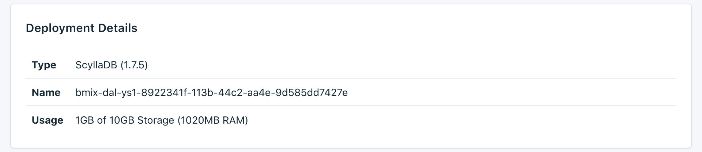

---

Copyright:
  years: 2017,2018
lastupdated: "2017-12-11"
---

{:new_window: target="_blank"}
{:shortdesc: .shortdesc}
{:screen: .screen}
{:codeblock: .codeblock}
{:pre: .pre}

# Übersicht über den Service

Auf der Seite _Übersicht_ finden Sie Informationen zu Ihrer {{site.data.keyword.cloud}} Compose-Datenbank. Die Übersicht enthält die zentralen Identifikationsinformationen sowie die aktuelle Ressourcennutzung. Außerdem finden Sie einen Abschnitt für Verbindungszeichenfolgen, die Sie mit Tools verwenden können, und Angaben zum Herstellen von Verbindungen zu Ihrer Datenbank mithilfe von Tools.

## Bereitstellungsdetails

Die Anzeige _Bereitstellungsdetails_ enthält Details zu Ihrem Service.

### Typ

Der Datenbanktyp, der vom Service angeboten wird, und die Datenbankversion, die Ihr Service verwendet. Wenn eine neuere Datenbankversion verfügbar ist, wird eine Benachrichtigung zusammen mit einem Link zum Abschnitt [Upgradeversion](/docs/services/ComposeForScyllaDB/dashboard-settings.html#upgrade-version) Ihres Service-Dashboards angezeigt.

### Name

Eine interne ID für den Service.

### Nutzung

Die Größe Ihrer Datenbank und der von Ihrem Serviceplan bereitgestellte Speicherplatz.

## Aktuelle Jobs

Durch administrative Änderungen an Ihrem Service (wie Skalieren oder Erstellen einer manuellen Sicherung) starten Sie einen Job. Während der Ausführung eines Jobs, wird auf der Seite _Übersicht_ das Fenster _Aktuelle Jobs_ mit dem Jobnamen und einer Fortschrittsleiste angezeigt. Wenn der Job abgeschlossen ist, wird das Fenster _Aktuelle Jobs_ auf der Seite _Übersicht_ nicht mehr angezeigt.

## Verbindungszeichenfolgen

Die einzelnen Verbindungszeichenfolgen für Ihren Service befinden sich jeweils auf einer eigenen Registerkarte der Anzeige _Verbindungszeichenfolgen_.

### HTTPS

Eine per URI formatierte Verbindungszeichenfolge kann von bestimmten Clientbibliotheken verwendet werden und enthält alle Informationen, die andere Bibliotheken zum Herstellen einer Verbindung benötigen. Informationen dazu, wie sich mithilfe der Verbindungszeichenfolge eine Verbindung herstellen lässt, finden Sie im Abschnitt [Externe Anwendung verbinden](./connecting-external.html).

### Befehlszeile

Die **Befehlszeile** ist ein vorformatierter Befehl, der `cqlsh` mit den korrekten Parametern aufruft. Der angezeigte Befehl enthält die erforderlichen Flags (`--ssl` und `--cqlversion`).  Um ihn verwenden zu können, müssen die PostgreSQL-Client-Tools auf dem lokalen System installiert sein. Informationen dazu, wie Sie dazu vorgehen müssen, finden Sie im Abschnitt [Externe Anwendung verbinden](./connecting-external.html).

### Zuordnungen
Diese Adressumsetzungszuordnungen können in Anwendungen verwendet werden, die eine hohe Verfügbarkeit erfordern, und können Knoten mithilfe der automatischen Erkennung im Cluster auffinden. Sie setzen die externen Portaladressen für Clienttreiber, die diese Funktion verwenden, in die internen Clusteradressen um.

### Socks und Nodetool
Der Service wird mit einer als SOCKS-Proxy konfigurierten SSH-Kapsel geliefert, um die nodetool-Verwaltung von Skylla zu ermöglichen. Sie müssen Ihrer Bereitstellung einen SSH-Schlüssel hinzufügen, um den Proxy verwenden zu können. Weitere Informationen dazu finden Sie im Abschnitt [Nodetool verwenden](./scylla-nodetool.html).

## Instanzverwaltungs-API

Sie können Ihren {{site.data.keyword.composeForScyllaDB}}-Service über die {{site.data.keyword.cloud_notm}} Compose-API verwalten.

### Basisendpunkt

Der Basisendpunkt setzt sich aus der Region, in der sich der Service befindet, und der Serviceinstanz-ID zusammen. Er steht am Anfang von jedem Endpunkt.

### Bereitstellungs-ID

Die Bereitstellungs-ID wird für die meisten Aufrufe benötigt und gibt eine bestimmte Bereitstellungsinstanz an.

### Referenz

Zusätzliche Dokumentation und Referenz zur Verwendung der {{site.data.keyword.cloud_notm}} Compose-API für alle {{site.data.keyword.cloud_notm}} Compose-Services finden Sie in [Die {{site.data.keyword.cloud_notm}} Compose-API](https://www.compose.com/articles/the-ibm-cloud-compose-api/).
