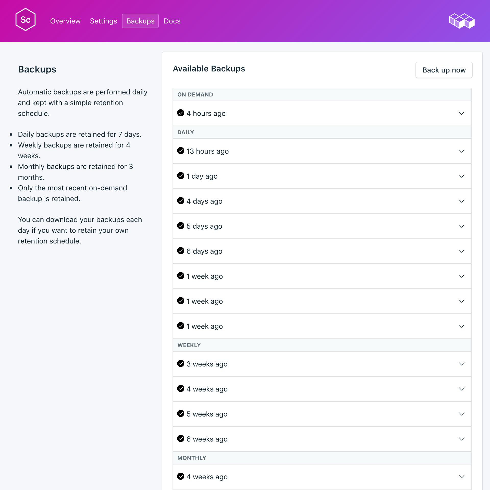
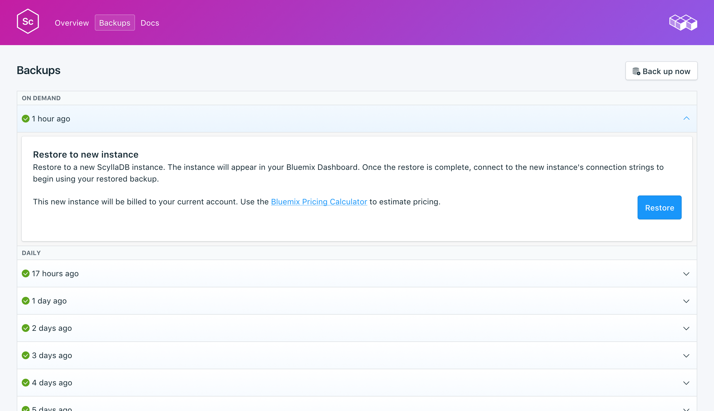

---

copyright:
  years: 2017,2018
lastupdated: "2017-10-16"
---

{:new_window: target="_blank"}
{:shortdesc: .shortdesc}
{:screen: .screen}
{:codeblock: .codeblock}
{:pre: .pre}

# Copias de seguridad
{: #backups}

Puede crear y descargar copias de seguridad desde el separador _Copias de seguridad_ de la página _Gestionar_ del panel de control del servicio. Las copias de seguridad diarias, semanales, mensuales y bajo demanda están disponibles. Se retienen según la siguiente planificación:

Tipo de copia de seguridad|Planificación de retención
----------|-----------
Diario|Las copias de seguridad diarias se retienen durante 7 días
Semanal|Las copias de seguridad semanales se retienen durante 4 semanas
Mensual|Las copias de seguridad mensuales se retienen durante 3 meses
Bajo demanda|Se retiene una copia de seguridad bajo demanda. La copia de seguridad retenida es siempre la copia de seguridad bajo demanda más reciente.
{: caption="Tabla 1. Planificación de retención de copia de seguridad" caption-side="top"}

Las planificaciones de copia de seguridad y las políticas de retención están corregidas. Si necesita mantener más copias de seguridad de las que permite la planificación de retención, debe descargar copias de seguridad y retener archivados según sus necesidades empresariales.

## Visualización de las copias de seguridad existentes

Se planifican automáticamente copias de seguridad diarias de la base de datos. Para ver las copias de seguridad existentes, vaya a la página *Gestionar* del panel de control del servicio. 

Pulse en la fila correspondiente para ampliar las opciones para cualquier copia de seguridad disponible.

 

## Creación de una copia de seguridad a petición

Además de copias de seguridad planificadas, puede crear una copia de seguridad manualmente. Para crear una copia de seguridad manual, vaya a la página *Gestionar* del panel de control del servicio y pulse *Copia de seguridad ahora*.

## Restauración de una copia de seguridad
Para restaurar una copia de seguridad en una nueva instancia de servicio, siga los pasos para ver las copias de seguridad existentes y luego pulse en la fila correspondiente para ampliar las opciones para la copia de seguridad que desea descargar. Pulse el botón **Restaurar**. Se mostrará un mensaje que le indicará que se ha iniciado una restauración. A la nueva instancia del servicio se le asignará automáticamente el nombre "scylla-restore-[timestamp]" y aparecerá en el panel de control cuando comience el suministro.
