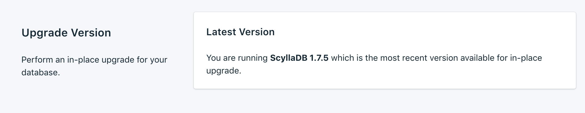
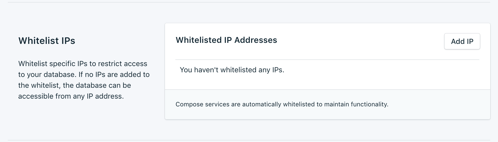

---

Copyright:
  Years: 2017
lastupdated: "2017-10-23"
---

{:new_window: target="_blank"}
{:shortdesc: .shortdesc}
{:screen: .screen}
{:codeblock: .codeblock}
{:pre: .pre}
{:tip: .tip}

# Valores

Estas características le permiten adaptar el servicio {{site.data.keyword.composeForScyllaDB_full}} para que se ajuste mejor a sus necesidades y requisitos.

## Versión de actualización

Si hay una nueva versión de la base de datos disponible, aparece un menú desplegable que le permite seleccionar la versión a la que desea actualizar. Si no la hay, significa que el servicio está al nivel de la versión más reciente y el panel muestra la información de la versión actual.

## Escalado de recursos

Si el servicio necesita más almacenamiento, o si desea reducir la cantidad de almacenamiento asignado a su servicio, puede hacerlo mediante el escalado de recursos.

1. Vaya a la página _Visión general_ del servicio.
2. En el panel _Detalles de despliegue_, pulse **Escalar recursos**. Se abre la página Escalar recursos.

    

3. Ajuste el graduador para aumentar o reducir el almacenamiento asignado al servicio {{site.data.keyword.composeForScyllaDB}}. Mueva el graduador a la izquierda para reducir la cantidad de almacenamiento o muévalo a la derecha para aumentar el almacenamiento.
4. Pulse **Despliegue de escalado** para activar el escalado y volver a la visión general del panel de control. Aparece un mensaje 'escalado iniciado' en la parte superior de la página que le indica que el proceso de escalado está en curso.

    

    Una vez finalizado el escalado, el panel _Detalles de despliegue_ se actualiza para mostrar el uso actual y el nuevo valor del almacenamiento disponible.

## Utilización de listas blancas

Si desea restringir el acceso a las bases de datos, puede crear una lista blanca de direcciones IP o rangos de direcciones IP específicos en el servicio. Cuando no hay direcciones IP en la lista blanca, esta se inhabilita y el despliegue aceptará conexiones procedentes de cualquier sistema de internet.

### Direcciones IP
El campo *IP* acepta una sola dirección IPv4 o dirección IPv6 completa con o sin máscara de red. Sin máscara de red, las conexiones entrantes deben proceder exactamente de esa dirección IP. 

Tenga en cuenta que, aunque la entrada IP permite IPv6, actualmente no hay despliegues de Compose disponibles para redes IPv6, de modo que no se puede filtrar por estas direcciones.

### Máscaras de red
Para permitir una conexión procedente de un rango específico de direcciones IP, utilice una máscara de red. La dirección IP se debe especificar por completo cuando se utiliza una máscara de red. Esto significa especifica, por ejemplo, 192.168.1.0/24 en lugar de 192.168.1/24.

### Descripción
La *Descripción* puede ser cualquier texto significativo especificado por el usuario para identificar la entrada de la lista blanca: un nombre de cliente, el identificador del proyecto o un número de empleado, por ejemplo. El campo de descripción es obligatorio.

### Servicios de Compose
Las entradas de la lista blanca se añaden automáticamente a los servidores de Compose para permitir que se conecten.

### Eliminación
Para eliminar una dirección IP o una máscara de red de la lista blanca, pulse *Eliminar* junto a la entrada.
Si se eliminan todas las entradas de la lista blanca, la lista blanca se inhabilita y los portales de acceso TCP aceptarán todas las direcciones IP.
