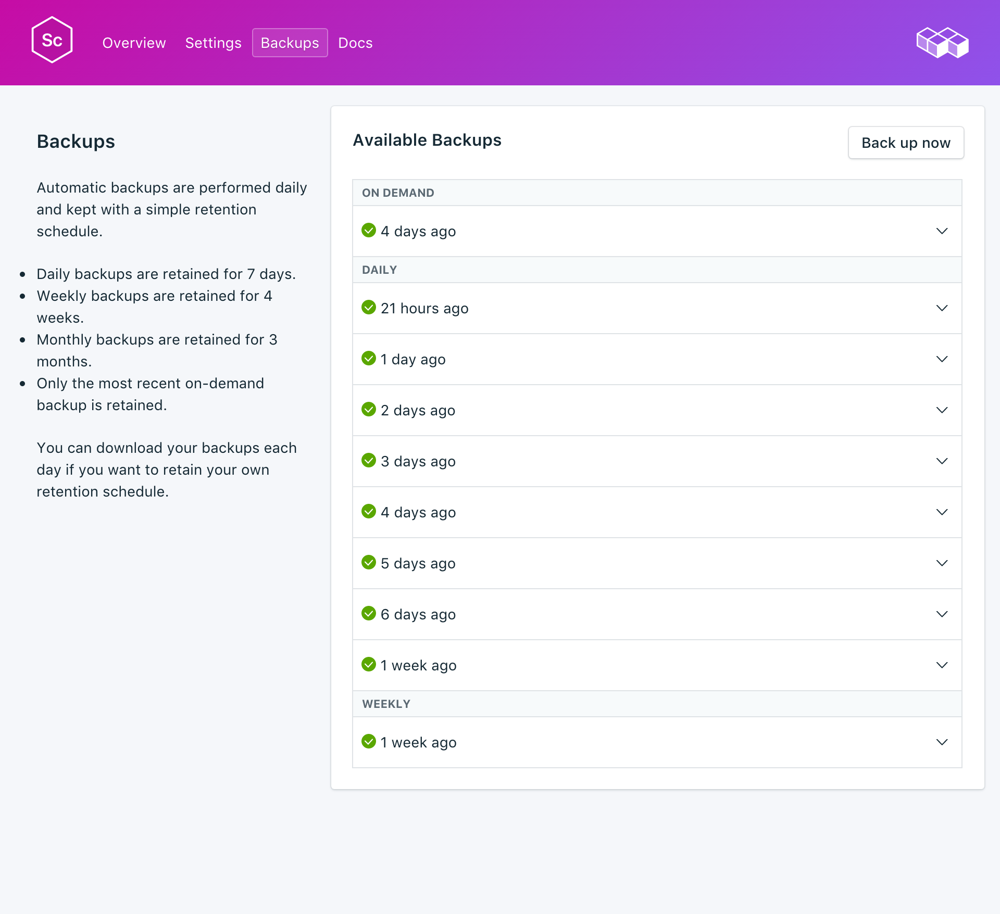

---

copyright:
  years: 2017,2018
lastupdated: "2017-10-16"
---

{:new_window: target="_blank"}
{:shortdesc: .shortdesc}
{:screen: .screen}
{:codeblock: .codeblock}
{:pre: .pre}

# Sauvegardes
{: #backups}

Vous pouvez créer et télécharger des sauvegardes à partir de l'onglet _Backups_ de la page _Gérer_ du tableau de bord de votre service. Vous avez le choix entre les sauvegardes quotidiennes, hebdomadaires, mensuelles et à la demande. Elles sont conservées selon la planification suivante :

Type de sauvegarde|Planification de conservation
----------|-----------
Quotidienne|Les sauvegardes quotidiennes sont conservées pendant 7 jours
Hebdomadaire|Les sauvegardes hebdomadaires sont conservées pendant 4 semaines
Mensuelle|Les sauvegardes mensuelles sont conservées pendant 3 mois
A la demande|Une seule sauvegarde à la demande est conservée. Il s'agit toujours de la dernière sauvegarde à la demande effectuée.
{: caption="Tableau 1. Planification de conservation des sauvegardes" caption-side="top"}

Les planifications de sauvegarde et les règles de conservation sont fixées. Si vous avez besoin de conserver davantage de sauvegardes que ne le permet la planification de conservation, vous devez télécharger les sauvegardes et les archiver en fonction de vos exigences métier.

## Affichage des sauvegardes existantes

Des sauvegardes quotidiennes de votre base de données sont automatiquement planifiées. Pour afficher vos sauvegardes existantes, accédez à la page *Gérer* du tableau de bord de votre service. 

Cliquez sur la ligne correspondante pour développer les options de chaque sauvegarde disponible.

 

## Création d'une sauvegarde à la demande

Outre les sauvegardes planifiées, vous pouvez créer une sauvegarde manuelle. Pour créer une sauvegarde manuelle, accédez à la page *Gérer* du tableau de bord de votre service et cliquez sur *Backup now*.

## Restauration d'une sauvegarde
Pour restaurer une sauvegarde sur une nouvelle instance de service, suivez la procédure d'affichage des sauvegardes, puis cliquez sur la ligne correspondante afin de développer les options de la sauvegarde que vous voulez télécharger. Cliquez sur le bouton **Restore**. Un message vous indiquant qu'une restauration a été initiée s'affiche. La nouvelle instance de service sera automatiquement nommée "scylla-restore-[timestamp]" ; elle s'affiche dans votre tableau de bord au démarrage de la mise à disposition.
