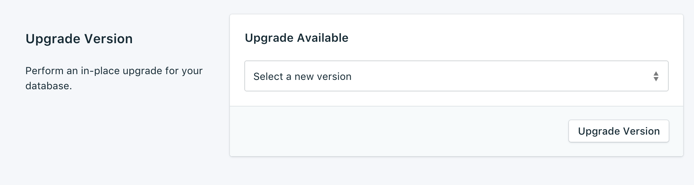
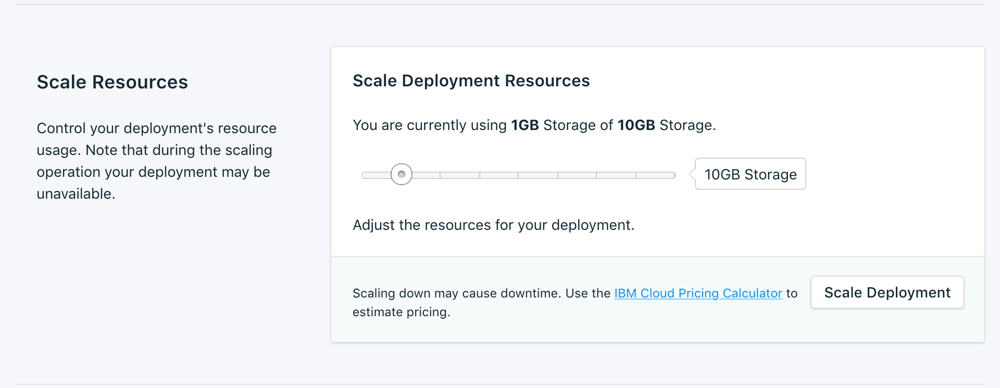
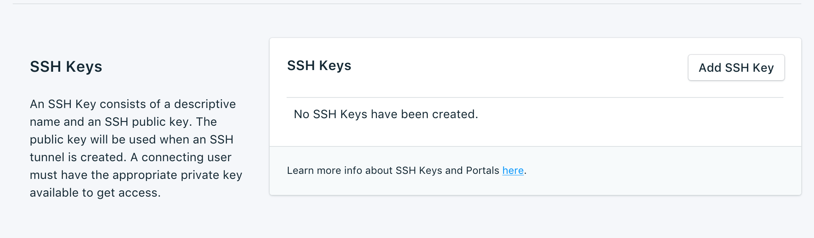

---

Copyright:
  years: 2017,2018
lastupdated: "2017-12-11"
---

# Paramètres

Utilisez {{site.data.keyword.composeForScyllaDB_full}} pour adapter votre service de sorte qu'il réponde mieux à vos besoins et exigences.

## Mise à niveau de la version

Lorsqu'une nouvelle version de la base de données est disponible, un menu déroulant s'affiche. Il vous permet de sélectionner la version vers laquelle vous voulez effectuer une mise à niveau. Si votre service est à la version la plus récente disponible, le panneau affiche les informations relatives à cette version.

## Mise à l'échelle des ressources

Si votre service a besoin de plus d'espace de stokage, ou si vous voulez limiter la quantité de stockage allouée au service, vous pouvez effectuer une mise à l'échelle des ressources.

1. Accédez à la page _Vue d'ensemble_ de votre service.
2. Dans le panneau _Deployment Details_, cliquez sur **Scale Resources**. La page Scale Resources s'ouvre.

    

3. Déplacez le curseur sur la règle pour augmenter ou diminuer la quantité de stockage allouée au service {{site.data.keyword.composeForScyllaDB}}. Déplacez-le vers la gauche pour diminuer la quantité de stockage ou vers la droite pour l'augmenter.
4. Cliquez sur **Scale Deployment** pour lancer le processus de mise à l'échelle et revenir dans la vue d'ensemble du tableau de bord. 

Une fois la mise à l'échelle terminée, le panneau _Deployment Details_ est actualisé pour afficher l'utilisation actuelle et la nouvelle valeur de stockage disponible.

## Utilisation des listes blanches

Si vous voulez limiter l'accès à vos bases de données, vous pouvez constituer une liste blanche d'adresses IP ou de plages d'adresses IP sur votre service. Lorsque la liste blanche ne contient aucune adresse IP, elle est désactivée et le déploiement accepte les connexions de tout système sur internet.

### Adresses IP
La zone *IP* accepte une adresse IPv4 ou IPv6 complète, avec ou sans masque de réseau. Sans masque de réseau, les connexions entrantes doivent provenir très exactement de cette adresse IP. 

Même si la zone IP accepte les adresses IPv6, aucun déploiement Compose n'est actuellement disponible pour un réseau IPv6 de sorte que ces adresses ne peuvent pas être filtrées.

### Masques de réseau
Pour autoriser une connexion à partir d'une plage spécifiée d'adresses IP, utilisez un masque de réseau. L'adresse IP doit être intégralement spécifiée lorsque vous utilisez un masque de réseau. Cela signifie que vous devez, par exemple, entrer 192.168.1.0/24 plutôt que 192.168.1/24.

### Description
La *Description* peut être tout texte significatif pour l'utilisateur lui permettant d'identifier l'entrée de la liste blanche, par exemple, nom de client, identificateur de projet ou matricule. La zone Description est obligatoire.

### Services Compose
Les entrées d'une liste blanche sont automatiquement ajoutées aux serveurs de Compose pour leur permettre de se connecter.

### Suppression
Pour supprimer une adresse IP ou un masque de réseau de la liste blanche, cliquez sur l'entrée *Retirer* en regard de l'élément à supprimer.
Lorsque toutes les entrées d'une liste blanche ont été supprimées, la liste est désactivée et toutes les adresses IP sont acceptées par les portails d'accès TCP.

## Clés SSH
Les services Scylla sont mis à disposition avec un portail SSH de manière à activer l'administration via nodetool du service. Ajoutez la clé publique et un nom pour accéder au portail SSH.

Pour plus d'informations sur le fonctionnement de nodetool avec votre service Scylla, [Utilisation de Nodetool](./scylla-nodetool.html).
