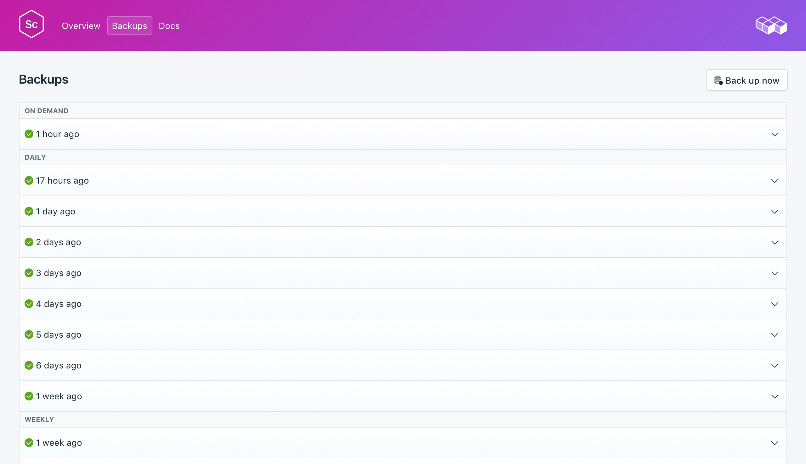
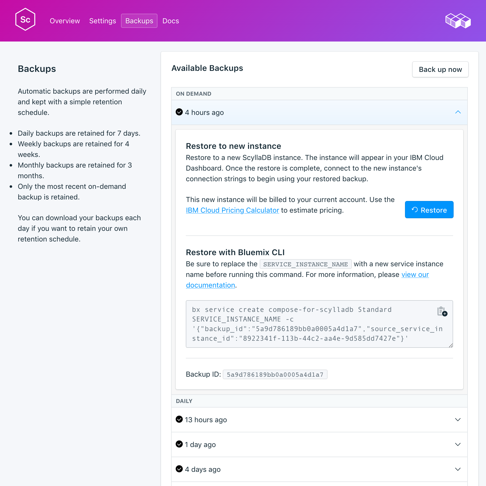

---

copyright:
  years: 2017
lastupdated: "2017-10-16"
---

{:new_window: target="_blank"}
{:shortdesc: .shortdesc}
{:screen: .screen}
{:codeblock: .codeblock}
{:pre: .pre}

# 백업
{: #backups}

서비스 대시보드의 *관리* 페이지에서 백업을 작성하고 다운로드할 수 있습니다. 스케줄된 백업과 수동 백업이 모두 사용 가능합니다. 

## 기존 백업 보기

데이터베이스의 일간 백업이 자동으로 스케줄됩니다. 기존 백업을 보려면 서비스 대시보드의 *관리* 페이지로 이동하십시오. 

해당 행을 클릭하여 사용 가능한 백업에 대한 옵션을 펼치십시오.

 

## 요청 시 백업 작성

스케줄된 백업은 물론 수동으로 백업을 작성할 수도 있습니다. 수동 백업을 작성하려면 서비스 대시보드의 *관리* 페이지로 이동하여 *지금 백업*을 클릭하십시오.

## 백업 복원
백업을 새 서비스 인스턴스에 복원하려면 단계에 따라 기존 백업을 확인한 후 해당 행을 클릭하여 다운로드할 백업에 대한 옵션을 펼치십시오. **복원** 단추를 클릭하십시오. 복원이 시작되었음을 알리는 메시지가 표시됩니다. 새 서비스 인스턴스가 자동으로 "scylla-restore-[timestamp]"로 이름 지정되고 프로비저닝이 시작될 때 대시보드에 표시됩니다.
