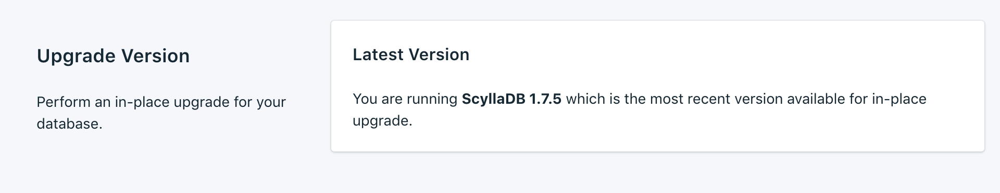
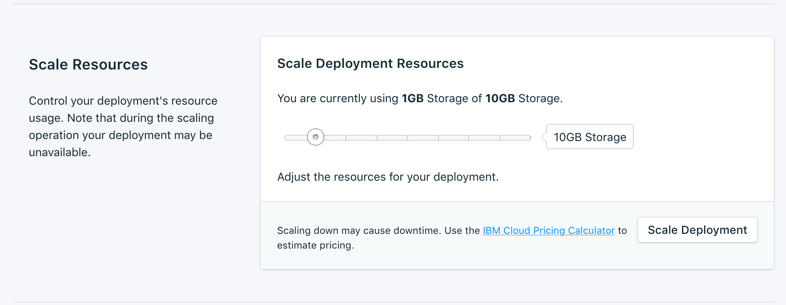
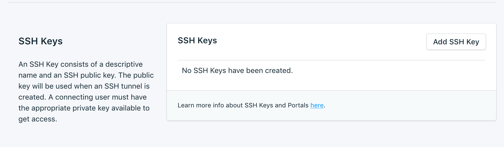

---

Copyright:
  years: 2017,2018
lastupdated: "2017-12-11"
---

{:new_window: target="_blank"}
{:shortdesc: .shortdesc}
{:screen: .screen}
{:codeblock: .codeblock}
{:pre: .pre}
{:tip: .tip}

# 설정

이러한 기능을 사용하여 필요와 요구사항에 가장 적합하도록 {{site.data.keyword.composeForScyllaDB_full}} 서비스를 조정할 수 있습니다.

## 버전 업그레이드

새 버전의 데이터베이스가 사용 가능한 경우 업그레이드하려는 버전을 선택할 수 있는 드롭 다운 메뉴가 표시됩니다. 그렇지 않으면 서비스가 사용 가능한 최신 버전이며 패널에 현재 버전 정보가 표시됩니다.

## 리소스 스케일링

서비스에 추가 스토리지가 필요하거나 서비스에 할당된 스토리지의 양을 줄이려는 경우 리소스를 스케일링하여 이를 수행할 수 있습니다.

1. 서비스의 _개요_ 페이지로 이동하십시오.
2. _배치 세부사항_ 패널에서 **리소스 스케일링**을 클릭하십시오. 리소스 스케일링 페이지가 열립니다.

    

3. 슬라이더를 조정하여 {{site.data.keyword.composeForScyllaDB}} 서비스에 할당된 스토리지를 늘리거나 줄이십시오. 스토리지의 양을 줄이려면 슬라이더를 왼쪽으로 이동하고 스토리지를 늘리려면 오른쪽으로 이동하십시오.
4. **배치 스케일링**을 클릭하여 재스케일링을 트리거하고 대시보드 개요로 돌아가십시오. 

스케일링이 완료되면 _배치 세부사항_ 분할창이 현재 사용량과 사용 가능한 스토리지에 대한 새로운 값을 표시하도록 업데이트됩니다.

## 화이트리스트 사용

데이터베이스에 대한 액세스를 제한하려는 경우 서비스에 대한 특정 IP 주소 또는 IP 주소 범위의 화이트리스트를 작성할 수 있습니다. 화이트리스트에 IP 주소가 없으면 화이트리스트가 사용 안함으로 설정되고 배치 시 인터넷의 모든 시스템으로부터의 연결이 허용됩니다.

### IP 주소
*IP* 필드는 넷마스크가 포함되거나 포함되지 않은 하나의 전체 IPv4 주소 또는 IPv6 필드를 받아들일 수 있습니다. 넷마스크가 없으면 수신 연결이 정확히 해당 IP 주소에서 발생해야 합니다. 

IPv6용 IP 항목이 허용되지만 현재 IPv6 네트워킹에는 Compose 배치가 사용 가능하지 않으므로 이러한 주소를 필터링할 수 없습니다.

### 넷마스크
지정된 IP 주소 범위로부터의 연결을 허용하려면 넷마스크를 사용하십시오. 넷마스크를 사용하는 경우 IP 주소를 전체적으로 지정해야 합니다. 즉, 예를 들어 192.168.1/24가 아니라 192.168.1.0/24를 입력합니다.

### 설명
*설명*은 화이트리스트 항목(예: 고객 이름, 프로젝트 ID 또는 직원 번호)을 식별하기 위한 사용자에게 의미 있는 텍스트일 수 있습니다. 설명 필드는 필수입니다.

### Compose 서비스
화이트리스트 항목이 자동으로 Compose의 서버에 추가되어 연결하도록 허용합니다.

### 제거
IP 주소 또는 넷마스크를 화이트리스트에서 제거하려면 옆에 표시된 *제거* 항목을 클릭하십시오.
화이트리스트의 모든 항목이 제거되면 화이트리스트가 사용 안함으로 설정되고 모든 IP 주소가 TCP 액세스 포털에서 허용됩니다.

## SSH 키
Scylla 서비스는 nodetool을 통해 서비스를 관리할 수 있도록 하기 위해 SSH 포털과 함께 프로비저닝됩니다. SSH 포털에 대한 액세스 권한을 얻기 위한 공개 키 및 이름을 추가하십시오.

nodetool이 Scylla 서비스와 어떻게 상호작용하는지에 대한 정보는 [nodetool 사용](./scylla-nodetool.html)에 있습니다.
