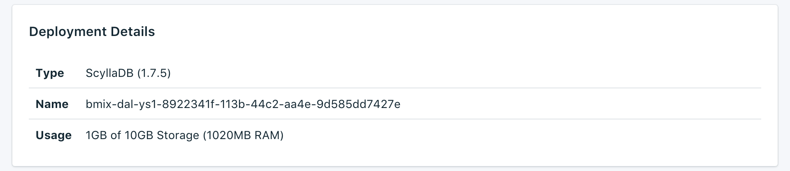

---

Copyright:
  years: 2017,2018
lastupdated: "2018-05-07"
---

{:new_window: target="_blank"}
{:shortdesc: .shortdesc}
{:screen: .screen}
{:codeblock: .codeblock}
{:pre: .pre}

# 服务概述

_概述_页面显示有关 {{site.data.keyword.cloud}} Compose 数据库的信息。此概述包含基本的标识信息和当前资源使用情况。您还将找到一个用于连接字符串的部分，您可以将这些连接字符串与工具一起使用，也可以使用工具来连接到数据库。

## 部署详细信息

_部署详细信息_面板显示服务的详细信息。

### 类型

服务所提供的数据库类型，以及服务所使用的数据库版本。如果有更新的数据库版本可用，那么会显示通知以及指向服务仪表板中[升级版本](/docs/services/ComposeForScyllaDB/dashboard-settings.html#upgrade-version)部分的链接。

### 标识

服务的内部标识。

### 使用情况

数据库的大小和服务套餐所提供的存储量。

## 当前作业

对服务进行管理更改（例如，扩展或执行手动备份）会启动作业。作业正在运行时，_当前作业_面板会显示在_概述_页面上，其中显示作业名和进度条。作业完成后，_当前作业_面板即不会再显示在_概述_页面上。

## 连接字符串

您将在_连接字符串_面板的其他选项卡中找到服务的每个“连接字符串”。

### HTTPS

这是 URI 格式的连接字符串，可供某些客户机库使用，并包含其他库连接所需的所有信息。您可以在[连接外部应用程序](./connecting-external.html)中找到如何使用连接字符串进行连接的信息。

### 命令行

**命令行**是一个预先格式化的命令，它将使用正确的参数来调用 `cqlsh`。显示的命令包含必需的标志（`--ssl` 和 `--cqlversion`）。要使用它，您需要在本地系统上安装 PostgreSQL 客户机工具。您可以在[连接外部应用程序](./connecting-external.html)中找到有关如何执行此操作的更多信息。

### 映射
这些地址转换映射可以在需要高可用性的应用程序中使用，并且可以使用自动发现来查找集群中的节点。他们将外部门户网站地址转换为使用此功能的客户机驱动程序的内部集群地址。

### Socks 和 Nodetool
为了支持 nodetool 对 Scylla 进行管理，该服务随附配置为 SOCKS 代理的 SSH 封装体。您需要将 SSH 密钥添加到部署才能使用该代理。您可以在[使用 Nodetool](./scylla-nodetool.html) 中找到更多信息。

## 实例管理 API

您可以通过 {{site.data.keyword.cloud_notm}} Compose API 来管理 {{site.data.keyword.composeForScyllaDB}} 服务。

### 基础端点

基础端点由服务所在的区域和服务实例标识组成。基础端点将位于每个端点的开头。

### 部署标识

部署标识对于大多数调用都是必需的，用于标识特定的部署实例。

### 参考

有关在所有 {{site.data.keyword.cloud_notm}} Compose 服务上使用 {{site.data.keyword.cloud_notm}} Compose API 的更多文档和参考信息，请参阅 [{{site.data.keyword.cloud_notm}} Compose API](https://www.compose.com/articles/the-ibm-cloud-compose-api/)。
