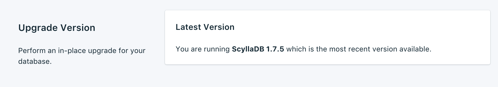
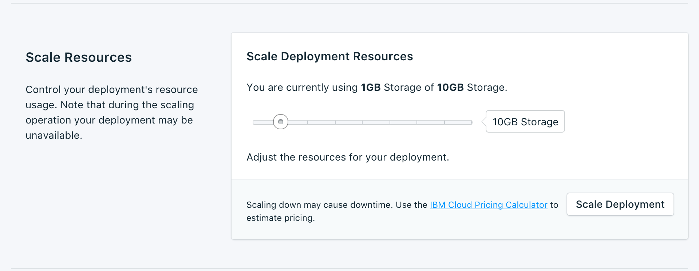
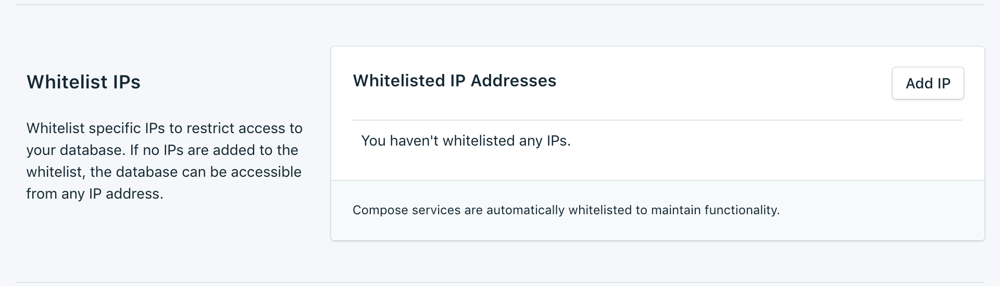

---

Copyright:
  Years: 2017
lastupdated: "2017-10-23"
---

{:new_window: target="_blank"}
{:shortdesc: .shortdesc}
{:screen: .screen}
{:codeblock: .codeblock}
{:pre: .pre}
{:tip: .tip}

# 设置

通过这些功能，您可以调整 {{site.data.keyword.composeForScyllaDB_full}} 服务，以更满足您的需要和需求。

## 升级版本

如果有新版本的数据库可用，那么会出现一个下拉菜单，允许您选择要升级到的版本。否则，服务将处于最新可用版本，而面板会显示当前版本信息。

## 扩展资源

如果您的服务需要额外存储空间，或者您要减少分配给服务的存储量，那么可以通过扩展资源来完成此操作。

1. 浏览至服务的_概述_页面。
2. 在_部署详细信息_面板中，单击**扩展资源**。此时将打开“扩展资源”页面。

    

3. 调整滑块以提高或降低分配给 {{site.data.keyword.composeForScyllaDB}} 服务的存储量。将滑块向左移动以减少存储量，或将其向右移动以增加存储量。
4. 单击**扩展部署**以触发重新扩展并返回到仪表板概述页面。页面顶部将显示“已启动扩展”消息，通知您正在进行重新扩展。

    

    扩展完成时，_部署详细信息_窗格将会更新以显示可用存储器的当前使用情况和新值。

## 使用白名单

如果要限制对数据库的访问，可以将特定 IP 地址或 IP 地址范围加入到服务白名单中。当白名单中没有 IP 地址时，会禁用白名单且部署将接受因特网上来自任何系统的连接。

### IP 地址
*IP* 字段可以采用带或不带网络掩码的单一完整 IPv4 地址或 IPv6 地址。如果没有网络掩码，入站连接必须确切来自该 IP 地址。 

请注意，尽管 IPv6 允许 IP 条目，但是当前没有任何 Compose 部署可用于 IPv6 网络，因此无法对这些地址进行过滤。

### 网络掩码
要允许来自指定 IP 地址范围的连接，请使用网络掩码。使用网络掩码时，必须完全指定 IP 地址。例如，这意味着输入 192.168.1.0/24 而不是 192.168.1/24。

### 描述
*描述*可以是用于标识白名单条目的任何用户重要文本 - 例如，客户名称、项目标识或员工编号。描述字段是必需的。

### Compose 服务
白名单条目会自动添加到 Compose 的服务器，以允许它们进行连接。

### 除去
要从白名单中除去 IP 地址或网络掩码，请单击旁边显示的*除去*条目。
除去白名单上的所有条目后，将禁用白名单，并且 TCP 访问门户网站将接受所有 IP 地址。
