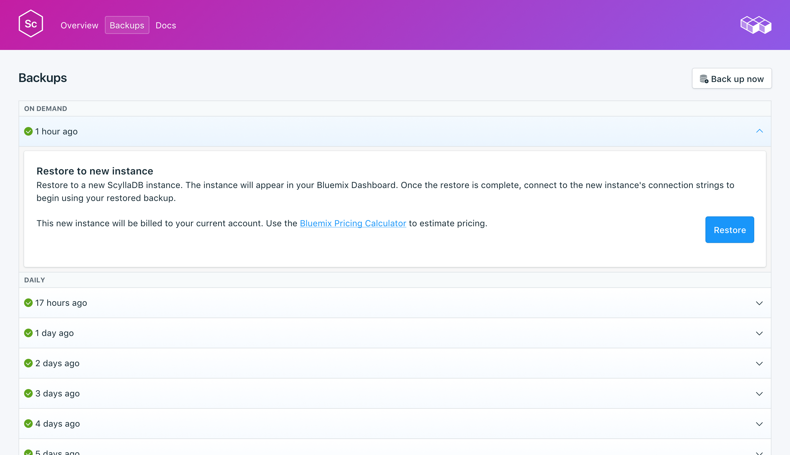

---

copyright:
  years: 2017,2018
lastupdated: "2017-10-16"
---

{:new_window: target="_blank"}
{:shortdesc: .shortdesc}
{:screen: .screen}
{:codeblock: .codeblock}
{:pre: .pre}

# 備份
{: #backups}

您可以從服務儀表板的_管理_ 頁面的_備份_ 標籤中，建立及下載備份。有每日、每週、每月及隨需應變備份可供使用。系統會根據下列排程保留它們：

備份類型|保留排程
----------|-----------
每日|每日備份保留 7 日
每週|每週備份保留 4 週
每月|每月備份保留 3 個月
隨需應變|保留一個隨需應變備份。保留的備份一律是最新的隨需應變備份。
{: caption="表 1. 備份保留排程" caption-side="top"}

備份排程與保留原則是固定的。如果您需要保留的備份數目超過保留排程所容許的數目，則應該根據您的商業需求下載備份及保留保存檔。

## 檢視現有備份

資料庫的每日備份是自動排定的。若要檢視現有備份，請導覽至服務儀表板的*管理* 頁面。 

  

按一下對應列來展開任何可用備份的選項。

   

### 使用 API 檢視現有備份

備份的清單位於 `GET /2016-07/deployments/:id/backups` 端點上。具有服務實例 ID 及部署 ID 的「基礎端點」都會顯示在服務的_概觀_ 中。例如： 
``` 
https://composebroker-dashboard-public.mybluemix.net/api/2016-07/instances/$INSTANCE_ID/deployments/$DEPLOYMENT_ID/backups
```    

## 依需求建立備份

除了排程備份外，您也可以手動建立備份。若要建立手動備份，請導覽至服務儀表板的*管理* 頁面，然後按一下*立即備份*。

### 使用 API 建立備份

請將 POST 要求傳送至備份端點，以起始手動備份：`POST /2016-07/deployments/:id/backups`。它會立即傳回所執行備份的秘訣 ID 及資訊。您需要檢查備份端點，以查看備份是否已完成，並在使用之前找到其 backup_id。請使用 `GET /2016-07/deployments/:id/backups/`。

## 還原備份
若要將備份還原至新的服務實例，請遵循步驟來檢視現有備份，然後按一下對應列以展開您要下載之備份的選項。按一下**還原**按鈕。即會顯示一則訊息，讓您知道已起始還原。新的服務實例會自動命名為 "scylla-restore-[timestamp]"，而且在佈建開始時，儀表板上會出現這個實例。

### 透過 {{site.data.keyword.cloud_notm}} CLI 還原

請使用下列步驟，以使用 {{site.data.keyword.cloud_notm}} CLI 將備份從執行中 Scylla 服務還原至新的 Scylla 服務。 
1. 如果您需要，請[下載並安裝它](https://console.bluemix.net/docs/cli/index.html#overview)。 
2. 在服務的_備份_ 頁面上，尋找您要從中還原的備份，然後複製備份 ID。  
  **或**  
  使用 `GET /2016-07/deployments/:id/backups`，透過 Compose API 尋找備份及其 ID。「基礎端點」及服務實例 ID 都會顯示在服務的_概觀_ 中。例如： 
  ``` 
  https://composebroker-dashboard-public.mybluemix.net/api/2016-07/instances/$INSTANCE_ID/deployments/$DEPLOYMENT_ID/backups
  ```  
  回應將會有該服務實例之所有可用備份的清單。請挑選您要從中還原的備份，並複製其 ID。

3. 使用適當的帳戶及認證登入。`bx login`（或 `bx login -help` 以查看所有登入選項）。

4. 切換至「組織」及「空間」：`bx target -o "$YOUR_ORG" -s "YOUR_SPACE"`

5. 使用 `service create` 指令來佈建新的服務，並提供您要在 JSON 物件中還原的來源服務及特定備份。例如：
``` 
bx service create SERVICE PLAN SERVICE_INSTANCE_NAME -c '{"source_service_instance_id": "$SERVICE_INSTANCE_ID", "backup_id": "$BACKUP_ID" }'
```
  _SERVICE_ 欄位應該是 compose-for-scylladb，而 _PLAN_ 欄位應該是 Standard（標準）或 Enterpris（企業），視您的環境而定。_SERVICE\_INSTANCE\_NAME_ 是您將放置新服務名稱的位置。_source\_service\_instance\_id_ 是備份來源的服務實例 ID；其取得方式是執行 `bx cf service DISPLAY_NAME --guid`，其中 _DISPLAY\_NAME_ 是備份來源的 Scylla 服務名稱。 
  
  企業使用者也將需要使用 `"cluster_id": "$CLUSTER_ID"` 參數，在 JSON 物件中指定要部署至其中的叢集。
  
### 移轉至新版本

現行執行中部署無法進行部分主要版本升級。您需要佈建將執行已升級版本的新服務，然後使用備份將您的資料移轉至其中。此處理程序與上面的還原備份處理程序相同，但您將指定要升級為的版本。

``` 
bx service create SERVICE PLAN SERVICE_INSTANCE_NAME -c '{"source_service_instance_id": "$SERVICE_INSTANCE_ID", "backup_id": ""$BACKUP_ID", "db_version":"$VERSION_NUMBER" }'
```

例如，將舊版的 {{site.data.keyword.composeForScyllaDB}} 服務還原為執行 Scylla 2.0.3 的新服務如下所示：
```
bx service create compose-for-scylladb Standard migrated_scylla -c '{ "source_service_instance_id": "0269e284-dcac-4618-89a7-f79e3f1cea6a", "backup_id":"5a96d8a7e16c090018884566", "db_version":"2.0.3"  }'

