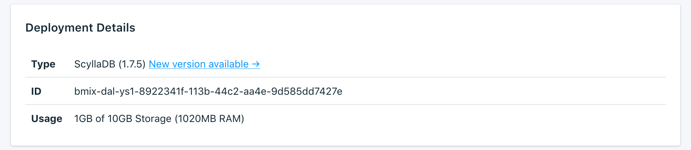

---

Copyright:
  years: 2017,2018
lastupdated: "2018-05-07"
---

{:new_window: target="_blank"}
{:shortdesc: .shortdesc}
{:screen: .screen}
{:codeblock: .codeblock}
{:pre: .pre}

# 服務概觀

_概觀_ 頁面顯示 {{site.data.keyword.cloud}} Compose 資料庫的相關資訊。概觀包括基本識別資訊及現行資源用量。您也會找到一個連線字串區段，您可以與工具搭配使用，或利用工具來連接至您的資料庫。

## 部署詳細資料

_部署詳細資料_ 畫面顯示服務的詳細資料。

### 類型

服務所提供的資料庫類型，以及服務使用的資料庫版本。如果有更新的資料庫版本可用，則會顯示通知，並附有一個鏈結，可讓您前往服務儀表板的[升級版本](/docs/services/ComposeForScyllaDB/dashboard-settings.html#upgrade-version)區段。

### ID

服務的內部 ID。

### 用量

服務方案所提供的資料庫大小及儲存空間數量。

## 現行工作

對您的服務進行管理變更（例如調整或建立手動備份）會啟動工作。工作在執行時，_現行工作_ 畫面會出現在_概觀_ 頁面上，同時顯示工作名稱及進度列。工作完成之後，_現行工作_ 畫面便不再出現在_概觀_ 頁面上。

## 連線字串

您將在_連線字串_ 畫面的另一個標籤中，找到服務的每一個「連線字串」。

### HTTPS

URI 格式的連線字串，可由某些用戶端程式庫使用，且包含其他程式庫進行連接時所需的一切資訊。您可以在[連接外部應用程式](./connecting-external.html)中，瞭解如何使用連線字串來進行連接。

### 指令行

**指令行**是一個預先格式化的指令，它會使用正確的參數來呼叫 `cqlsh`。顯示的指令包括必要旗標（`--ssl` 及 `--cqlversion`）。若要使用它，您需要在本端系統上安裝 PostgreSQL 用戶端工具。您可以在[連接外部應用程式](./connecting-external.html)中，進一步瞭解如何執行此作業。

### 對映
這些位址轉換對映可用於需要高可用性的應用程式中，並且可以使用自動探索來尋找叢集中的節點。它們會將外部入口網站位址轉換為使用此特性之用戶端驅動程式的內部叢集位址。

### Socks 與 Nodetool
為了啟用 Scylla 的 Nodetool 管理，服務隨附一個配置為 SOCKS Proxy 的 SSH 膠囊。您需要將 SSH 金鑰新增至部署，才能使用 Proxy。您可以在[使用 Nodetool](./scylla-nodetool.html) 中進一步瞭解。

## 實例管理 API

您可以透過 {{site.data.keyword.cloud_notm}} Compose API 管理 {{site.data.keyword.composeForScyllaDB}} 服務。

### 基礎端點

基礎端點是由服務所在地區及服務實例 ID 所組成。它將位於每個端點的開頭處。

### 部署 ID

大部分呼叫都需要部署 ID，部署 ID 可識別特定的部署實例。

### 參考資料

如需如何在所有 {{site.data.keyword.cloud_notm}} Compose 服務中使用 {{site.data.keyword.cloud_notm}} Compose API 的其他文件及參考資料，請閱讀 [{{site.data.keyword.cloud_notm}} Compose API](https://www.compose.com/articles/the-ibm-cloud-compose-api/)。
