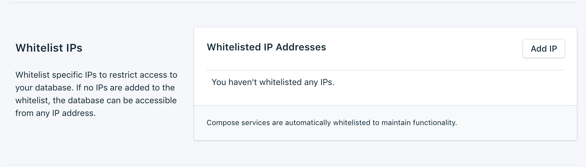
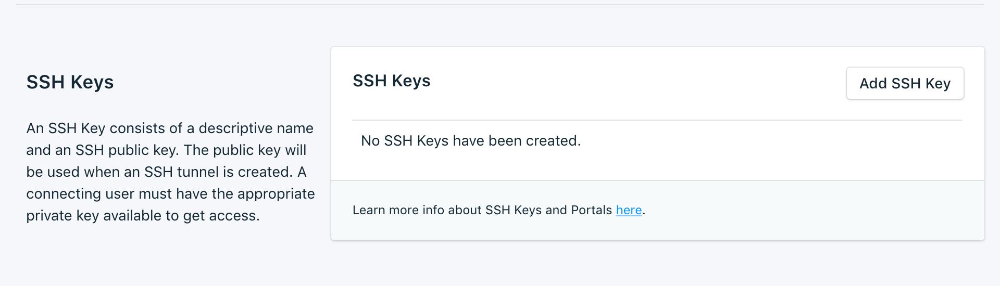

---

Copyright:
  years: 2017,2018
lastupdated: "2017-12-11"
---

{:new_window: target="_blank"}
{:shortdesc: .shortdesc}
{:screen: .screen}
{:codeblock: .codeblock}
{:pre: .pre}
{:tip: .tip}

# 設定

這些特性可讓您調整 {{site.data.keyword.composeForScyllaDB_full}} 服務以更符合您的需求。

## 升級版本

如果有可用的資料庫新版本，則會出現下拉功能表，讓您選取要升級至哪個版本。否則，您的服務即為最新的可用版本，且畫面會顯示現行版本資訊。

## 調整資源

如果您的服務需要額外的儲存空間，或您想要減少配置給服務的儲存空間數量，則可以透過調整資源來達成此目的。

1. 導覽至服務的_概觀_ 頁面。
2. 在_部署詳細資料_ 畫面中，按一下**調整資源**。即會開啟「調整資源」頁面。

    

3. 調整調節器來提高或降低配置給 {{site.data.keyword.composeForScyllaDB}} 服務的儲存空間。將調節器移至左邊以減少儲存空間數量，或將它移至右邊以增加儲存空間。
4. 按一下**調整部署**，以觸發重新調整作業並回到儀表板概觀。 

當調整完成時，_部署詳細資料_ 窗格會更新，以顯示可用儲存空間的現行用量及新值。

## 使用白名單

如果您要限制資料庫的存取，則可以將服務的特定 IP 位址或 IP 位址範圍列入白名單。當白名單中沒有任何 IP 位址時，會停用白名單，且部署會接受來自網際網路上任何系統的連線。

### IP 位址
*IP* 欄位可以採用含或不含網路遮罩的單一完整 IPv4 位址或 IPv6 位址。若沒有網路遮罩，送入的連線必須確切地來自該 IP 位址。 

請注意，雖然 IP 項目容許 IPv6，但沒有 Compose 部署可用於 IPv6 網路，因此無法過濾這些位址。

### 網路遮罩
若要容許來自指定 IP 位址範圍的連線，請使用網路遮罩。使用網路遮罩時，必須完整指定 IP 位址。例如，這表示會輸入 192.168.1.0/24 而非 192.168.1/24。

### 說明

*說明* 可以是任何使用者重要文字，用來識別白名單項目（例如，客戶名稱、專案 ID 或員工編號）。說明欄位為必要欄位。

### Compose 服務
白名單項目會自動新增至 Compose 的伺服器，以容許它們進行連接。

### 移除
若要從白名單中移除 IP 位址或網路遮罩，請按一下它旁邊顯示的*移除* 項目。
移除白名單上的所有項目時，會停用白名單， 因此 TCP 存取入口網站將接受所有 IP 位址。

## SSH 金鑰
Scylla 服務隨附了 SSH 入口網站，用來啟用服務的 Nodetool 管理。請新增公開金鑰及名稱，以取得 SSH 入口網站的存取權。

[使用 Nodetool](./scylla-nodetool.html) 中有 Nodetool 如何與 Scylla 服務搭配運作的相關資訊。
